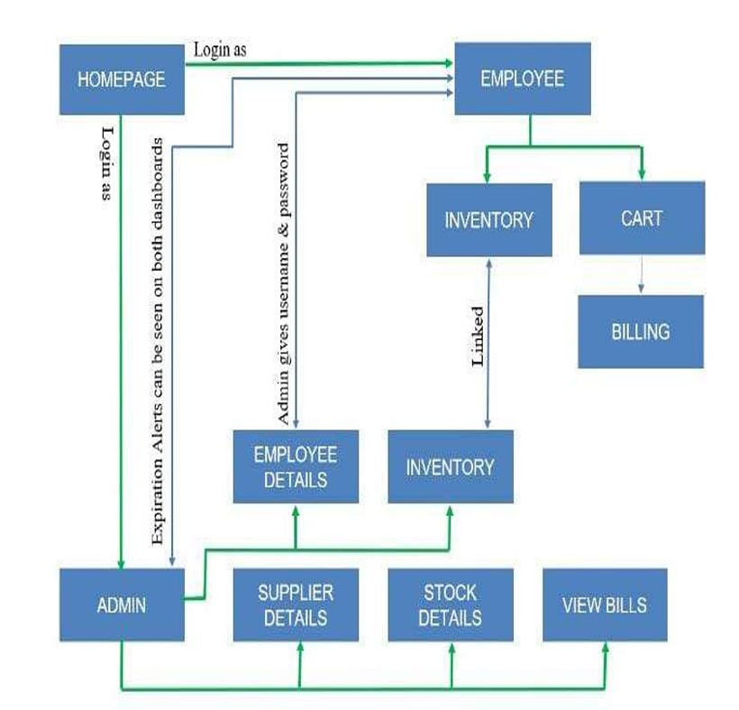
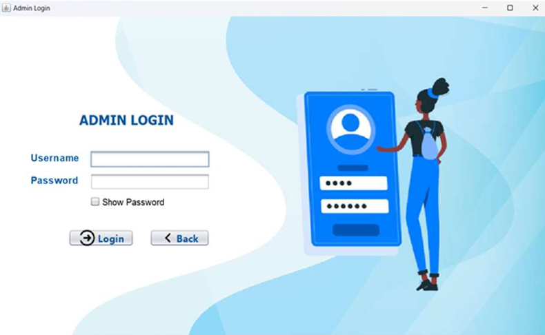
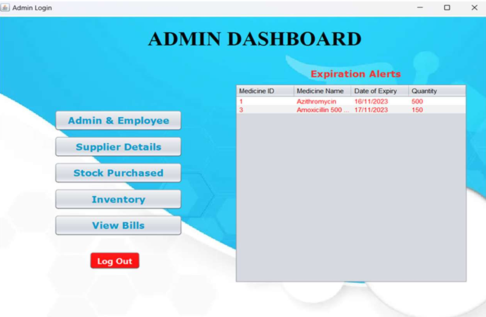
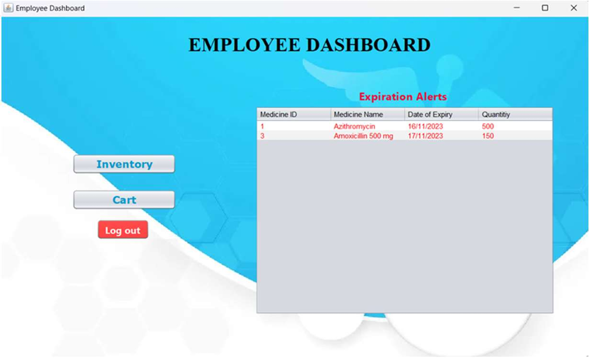
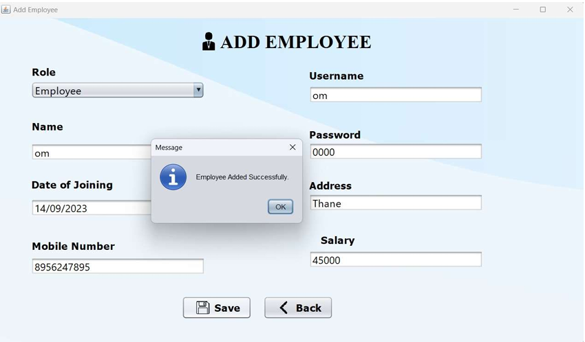
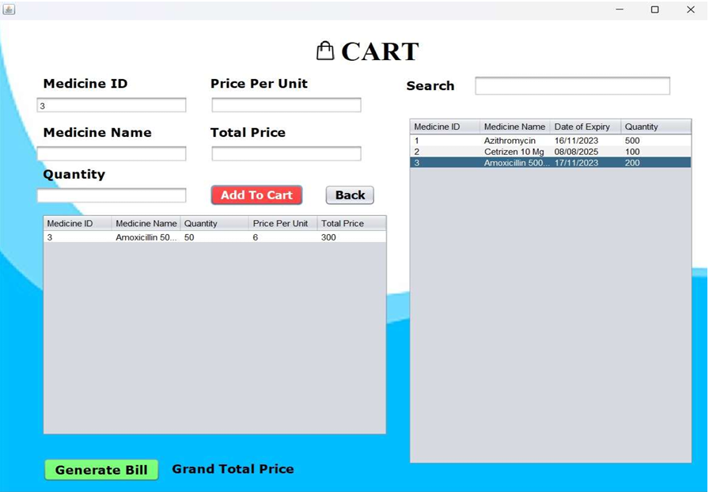
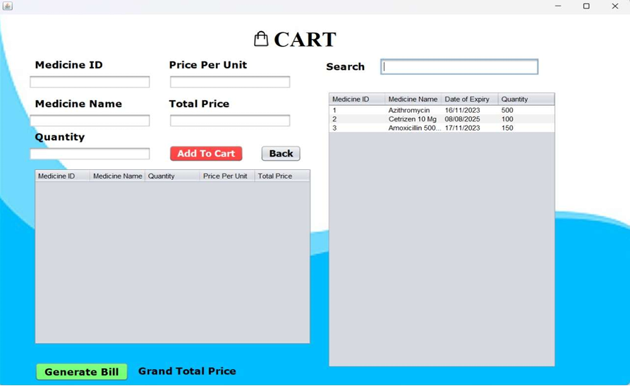
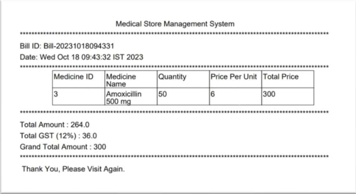

# 🏥 Medical Store Management System 💉

## 🌟 Project Overview

The **Medical Store Management System** is a robust and efficient **desktop application** developed as a mini-project for the Department of Information Technology at Datta Meghe College of Engineering.pdf]. It is designed to streamline and automate the operations of a pharmacy or medical store by addressing the complex requirements of managing inventory, sales, purchases, and employee records, moving away from manual methods.pdf].

  * **Core Technology:** Developed using **Java Swing** for a user-friendly GUI.pdf] and connected to a **MySQL** database for secure data storage and efficient data handling.pdf].
  * **Development Environment:** Built and managed using the **NetBeans IDE**.pdf].
  * **Authors:** Patil Vipul Jijabrao, Shekade Ram Keru, Singh Piyush Laxmi, Singh Rakesh Dinesh.pdf].

-----

## ✨ Problem Solved & Key Features

This system was created to overcome limitations found in traditional or basic systems, primarily focusing on **patient safety** and **operational efficiency**.pdf].

### 💡 Core Problem & Solution

| Problem/Limitation (Manual) | Solution (System Feature) |
| :--- | :--- |
| Potential for overlooking **medication expirations**. | **Alert System for Upcoming Expirations:** Monitors inventory and sends timely notifications to minimize financial losses and enhance patient safety.pdf]. |
| Lack of data-driven insights for procurement. | **Data of Most Selling Products:** Identifies and records frequently sold products to optimize inventory and purchasing.pdf]. |
| Security and complexity in management. | **Two Separate Dashboards (Admin/Employee):** Streamlines management, ensuring sensitive internal data is secure and accessible only to authorized personnel.pdf]. |

### 📋 Major Functionality (Scope)

  * **User Authentication & Authorization:** Separate **Admin login** (full access) and **Staff login** (limited access).pdf].
  * **Inventory Management:** Provides real-time tracking of stock levels, batch numbers, and expiry dates.pdf].
  * **Supplier Management:** Maintain a database of suppliers with contact information.pdf].
  * **Alerts and Notifications:** Sends alerts for low stock levels, expired products, and pending orders.pdf].
  * **Billing and Invoicing:** Allows for seamless data management and generation of accurate bills.pdf].

-----

## 💻 Technology Stack

This desktop application utilizes a proven and robust stack:

| Component | Technology | Requirement |
| :--- | :--- | :--- |
| **Programming Language** | `Java` | Java (JDK 5 or higher).pdf] |
| **User Interface** | `Java Swing` | Used for the desktop GUI.pdf] |
| **Database** | `MySQL` | Database / Backend.pdf] |
| **Development Environment** | `NetBeans IDE` | Software Requirement.pdf] |

### System Architecture

The overall structure of the system follows a layered approach, clearly linking the presentation, logic, and data layers.

-----

## ⚙️ Installation and Setup Guide

Follow these steps to set up the project locally using NetBeans and MySQL.

### 1\. 📋 Prerequisites

  * **Java Development Kit (JDK) 5 or higher**.pdf]
  * **NetBeans IDE**.pdf]
  * **MySQL Server**

### 2\. ⬇️ Get the Code

Clone the repository to your local machine:

```bash
git clone https://github.com/vipul-space23/Medical-Store-Management-System.git
cd Medical-Store-Management-System
```

### 3\. 💾 Database Configuration (MySQL)

1.  **Start MySQL Server**.
2.  **Create the Database:** Run `CREATE DATABASE medical_store_db;`.
3.  Import the SQL script file to set up all necessary tables (Schema).
4.  Ensure the **MySQL Connector/J JAR** file is correctly linked to your NetBeans project Libraries.

### 4\. 🚀 NetBeans Project Setup

1.  Open the project in **NetBeans IDE**.
2.  Update the database connection parameters (username, password) in the database connection class to match your local MySQL credentials.

### 5\. ▶️ Run the Application

Click the **Run Project** button (**F6**) in NetBeans.

-----

## 📸 Project Screenshots

### 🏗️ System Architecture


### 🏠 Home Screen


### 🔐 Admin Login


### 👨‍💼 Employee Login


### 🖥️ Admin Dashboard


### 👨‍🔧 Employee Dashboard


### ➕ Add Employee


### 🛒 Cart Before Billing


### 🛒 Cart After Billing


### 🧾 Generated Bill



## 🖼️ Application Walkthrough (Workflow)

The system is designed with a clear workflow.pdf].

### 1\. 🔑 Login and Initial Screens

The application starts by allowing the user to choose to **Login As** **Admin** or **Employee** (See: `Homescreen.png`).

### 2\. 👑 Dashboards and Employee Management

  * **Admin Dashboard:** Provides full control over all modules and displays **Expiration Alerts**.pdf] (See: `AdminDashboard.png`).
  * **Employee Dashboard:** A simpler dashboard focused on sales and inventory, also displaying **Expiration Alerts**.pdf] (See: `Employee-Dashboard.png`).

### 3\. 🛒 Sales and Billing Process

  * The billing interface is accessed via the **Cart** module, allowing items to be added for final calculation (See: `card-before-billing.png` and `card-after-billing.png`).
  * The final **Generated Bill** is displayed after the transaction (See: `report-bill-genrated.png`).

### Initial Access Credentials

  * **Default Admin Username:** `admin`
  * **Default Admin Password:** `admin123`

🚨 ***Security Warning: Change the default admin password immediately after your first successful login\!***

-----

## 📈 Results and Conclusion

The implementation of this software resulted in measurable operational improvements.pdf]:

  * **Reduction in Manual Errors:** Manual errors in sales and inventory management decreased by **90%**.pdf].
  * **Time Savings:** Staff reported a **30% reduction** in time spent on manual data entry and paperwork.pdf].
  * **Efficiency:** The system successfully tracked stock levels, leading to a decrease in carrying costs and an increased inventory turnover rate.pdf].

In conclusion, this software enhances the overall efficiency, accuracy, and productivity of medical store operations, ultimately benefiting both staff and customers.pdf].

-----

## 🔭 Future Scope

Key areas for future development include.pdf]:

  * **AI and Machine Learning:** For predictive analysis of medication demand and stock management.
  * **Mobile Apps and Online Ordering:** To offer convenience to patients and improve pharmacy efficiency.
  * **Compliance and Regulatory Support:** Staying up-to-date with evolving healthcare regulations.

-----

## 📜 License & Contact

This project is licensed under the **MIT License**.

**Project Author:** Vipul Patil

Project Link: [https://github.com/vipul-space23/Medical-Store-Management-System](https://www.google.com/search?q=https://github.com/vipul-space23/Medical-Store-Management-System)
